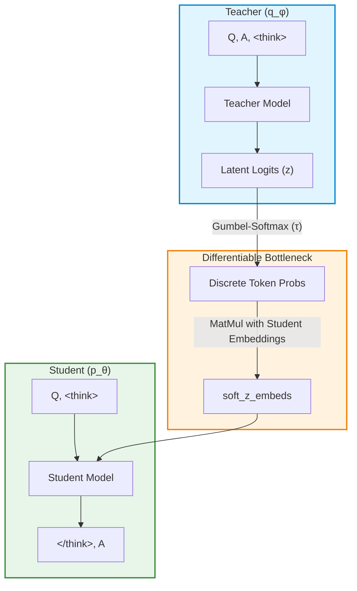

# Latent Reasoning via ELBO: Training a Latent Language LLM

## Abstract

This project explores the training of a Latent Language Large Language Model (LLM) using a Teacher-Student architecture. Our objective is to induce a continuous, hidden "thought process" (a latent language) that bypasses traditional human-readable reasoning tokens. By applying the Evidence Lower Bound (ELBO) and Gumbel-Softmax relaxations, the Teacher model is incentivized to compress its reasoning into a sequence of discrete latent tokens $z$. To prevent the Teacher from simply passing the final answer verbatim through the latents, we introduce an explicit Mutual Information (MI) penalty. Ultimately, our model develops a "digital cipher"—a 0% readable latent language that reliably solves complex mathematical reasoning problems.

---

## Architecture

Our training framework employs a Teacher-Student setup. The Teacher is allowed to see the final answer ($A$) before generating the latent reasoning sequence ($z$). The Student, however, does not see $A$ beforehand; it must generate $A$ conditioning solely on the Question ($Q$) and the latent embeddings $z$ it receives.

We use **Gumbel-Softmax** to bridge the discrete token generation of the Teacher with the continuous embedding space of the Student, enabling end-to-end differentiability.

---

## Mathematical Formulation

The objective is derived from the Evidence Lower Bound (ELBO), combining Cross-Entropy (CE), Kullback-Leibler (KL) divergence, and targeted entropy bonuses.

### 1. ELBO Loss

**Student Loss ($L_s$):**
The Student aims to predict the answer $A$ given the question $Q$ and the latent thought $z$. It is penalized by the KL divergence between its prior over $z$ and the Teacher's posterior:

$$
L_s = \text{CE}(A \mid z, Q) + \beta \cdot \text{KL}(q_\phi \parallel p_\theta)
$$

**Teacher Loss ($L_t$):**
The Teacher learns to generate useful latents while predicting the answer. An entropy bonus $\mathcal{H}(q)$ encourages the Teacher to explore less predictable latent distributions, preventing posterior collapse:

$$
L_t = \text{CE}(A \mid \text{ctx}) + \beta \cdot \text{KL}(q_\phi \parallel p_\theta) - \lambda_{\text{ent}} \cdot \mathcal{H}(q_\phi)
$$

### 2. Anti-Shortcut (Mutual Information Penalty)

To prevent the Teacher from using the latent space $z$ as a direct copy-paste channel for the answer $A$, we apply an **Anti-Shortcut Loss**. We run a forward pass of the Student where the Question ($Q$) is masked out, forcing the Student to predict $A$ using *only* $z$. 

We calculate the Cross-Entropy of this "blind" Student and apply a threshold-based penalty to the latent embeddings:

$$
\mathcal{L}_{\text{anti-shortcut}} = \lambda_{MI} \cdot \max(0, \ \text{MI}_{\text{target}} - \text{CE}(A \mid z))
$$

*(where $\lambda_{MI}$ is the `mi_coef` (1.5) and $\text{MI}_{\text{target}}$ is typically set to 15.0, reflecting the natural entropy of predicting answers from human reasoning without the question).* 
This explicitly penalizes the Teacher if the Mutual Information between $z$ and $A$ becomes too high (i.e. if $\text{CE}(A \mid z)$ drops below 15.0), forcing $z$ to encode the *reasoning process* rather than the final answer.

---

## Training Curriculum

We employ a dynamic scheduling strategy for the KL divergence penalty weight ($\beta$), known as the **Peak-and-Relax** strategy.

1. **Phase 1: Warmup & Compression (0 - 400 steps)**
   $\beta$ linearly increases from $0.0$ to a peak of $2.5$. The high $\beta$ exerts extreme pressure on the Teacher to compress its reasoning and align with the Student's prior, effectively forcing the model to abandon human-readable English in favor of dense informational encoding.
2. **Phase 2: Relax & Quality Focus (400 - 800 steps)**
   $\beta$ linearly decays from $2.5$ down to $0.01$. Once the latent cipher is established, relaxing the penalty allows the model to dedicate its capacity to minimizing the primary Cross-Entropy loss (i.e., getting the math answers right).
3. **Phase 3: Plateau (> 800 steps)**
   $\beta$ is held constant at $0.01$, fine-tuning the model's accuracy.

*(Simultaneously, the Gumbel-Softmax temperature $\tau$ is annealed from $2.0$ to $0.5$ over the first 400 steps to harden the discrete token choices).*

---

## Experimental Observations

During training, we observe a fascinating phenomenon: as the $\beta$ penalty peaks, the linguistic structure of the latent tokens completely disintegrates. The model successfully invents a **0% readability digital cipher**. 

Remarkably, despite bypassing the Mutual Information penalty (the latents do not leak the answer verbatim), this alien token sequence successfully drives the Student to solve complex mathematical problems.

### Training Logs (Placeholder)

| Step | $\beta$ | Latent Readability | Student CE | KL Div | MI Penalty CE | Accuracy |
|------|---------|--------------------|------------|--------|---------------|----------|
| 100  | 0.62    | 85.2%              | 1.45       | 0.12   | 2.10          | ~15%     |
| 400  | 2.50    | 12.4%              | 2.10       | 0.04   | 4.80          | ~22%     |
| 800  | 0.01    | **0.0%**           | 0.85       | 0.35   | 6.20          | ~58%     |
| 1000 | 0.01    | **0.0%**           | 0.72       | 0.38   | 6.35          | ~64%     |

*Observation:* At Step 800, readability drops to 0%, yet Student Cross-Entropy continues to improve significantly, indicating the successful acquisition of a latent reasoning language.
